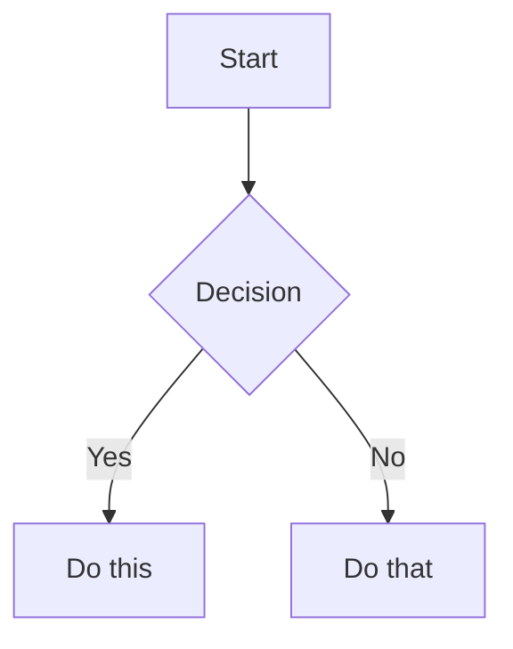

# Obsidian Flavored Markdown (OFM)

Obsidian extends CommonMark + GFM. This covers the Obsidian-specific syntax; standard Markdown (headings, bold/italic, lists, tables, code blocks) is assumed. Syntax here is verified against Obsidian's official docs.

## Internal links (wikilinks)

```markdown
[[Note Name]]                 link to a note
[[Note Name|Display Text]]    custom display text
[[Note Name#Heading]]         link to a heading
[[Note Name#^block-id]]       link to a block  (note the #^)
[[#Heading]]                  heading in the same note
[[#^block-id]]                block in the same note
```

Define a **block ID** by appending `^id` to the end of a paragraph:

```markdown
This paragraph can be linked to. ^my-block-id
```

For lists/quotes, put the block ID on its own line after the block:

```markdown
> A quote block

^quote-id
```

Use `[[wikilinks]]` for internal vault links (Obsidian auto-updates them on rename). Use standard `[text](url)` for external URLs.

## Embeds

Prefix any wikilink with `!` to embed its content inline:

```markdown
![[Note Name]]                embed an entire note
![[Note Name#Heading]]        embed a section
![[Note Name#^block-id]]      embed a block
![[image.png]]                embed an image
![[image.png|300]]            embed image at 300px width
![[image.png|640x480]]        width x height
![[audio.mp3]]                audio player
![[video.mp4]]                video player
![[document.pdf]]             PDF viewer
![[document.pdf#page=3]]      PDF at a page
![[MyBase.base]]              embed a Base
![[MyBase.base#View Name]]    embed a specific Base view
```

External image with width: ``

## Callouts

```markdown
> [!note]
> Basic callout.

> [!warning] Custom Title
> Callout with a custom title.

> [!faq]- Collapsed by default
> Foldable: `-` starts collapsed, `+` starts expanded.

> [!question] Outer
> > [!note] Nested
> > Callouts can nest.
```

Types (with common aliases) — lowercase is conventional, but they're case-insensitive:

| Type | Aliases |
|---|---|
| `note` | |
| `abstract` | `summary`, `tldr` |
| `info` | |
| `todo` | |
| `tip` | `hint`, `important` |
| `success` | `check`, `done` |
| `question` | `help`, `faq` |
| `warning` | `caution`, `attention` |
| `failure` | `fail`, `missing` |
| `danger` | `error` |
| `bug` | |
| `example` | |
| `quote` | `cite` |

Custom callout via CSS snippet:
```css
.callout[data-callout="custom"] { --callout-color: 100, 200, 150; --callout-icon: lucide-star; }
```

## Tags

```markdown
#tag  #nested/tag  #tag-with-dashes  #tag_with_underscores
```
Letters (any language), numbers (not first char), `_`, `-`, `/` (nesting). Also definable in frontmatter under `tags:`. See `properties-and-tags.md` for the taxonomy.

## Properties (frontmatter)

```yaml
---
title: My Note
type: concept
domain: shared
created: 2026-06-16
tags:
  - topic/example
aliases:
  - Alt Name
cssclasses:
  - wide
---
```
Full property model and the controlled vocabulary: `properties-and-tags.md`.

## Tasks

```markdown
- [ ] Open task
- [x] Done task
- [ ] Nested
  - [ ] Subtask
```
This is checkbox **syntax** for quick in-note steps. The vault tracks real tasks as **notes** (`type: task`) — see `note-types.md` → *Task* and the `Tasks.base` dashboard in `bases.md`. (The optional **Tasks** plugin adds due dates/recurrence to inline checkboxes — `community-plugins.md`.)

## Other syntax

```markdown
==highlight==                 highlighted text
%%inline comment%%            hidden in reading view
%%
multi-line comment, hidden
%%

Footnote reference[^1].       [^1]: footnote text.
Inline footnote.^[text here]
```

Math (LaTeX):
```markdown
Inline: $e^{i\pi}+1=0$
$$
\frac{a}{b}=c
$$
```

Diagrams (Mermaid):
````markdown

````
Link a Mermaid node to a note by adding `class NodeName internal-link;`.

Embed live search results:
````markdown
```query
tag:#topic/ai status:active
```
````

## Mini example (a filed note)

````markdown
---
type: concept
domain: shared
created: 2026-06-16
tags:
  - topic/productivity
---
# Progressive summarization

> Highlight your highlights in layers so the best ideas surface over time.

First pass: bold key sentences. Second pass: ==highlight== the best of the bold.

> [!tip] Why it works
> You only do deep work on notes you actually revisit.

## Connects to
- [[Building a Second Brain]]
- [[Maps/Productivity]]
````

## References
- Obsidian Flavored Markdown: https://help.obsidian.md/obsidian-flavored-markdown
- Links: https://help.obsidian.md/links · Embeds: https://help.obsidian.md/embeds
- Callouts: https://help.obsidian.md/callouts · Properties: https://help.obsidian.md/properties
